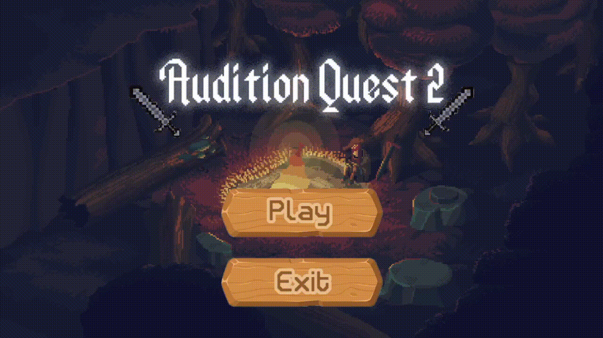
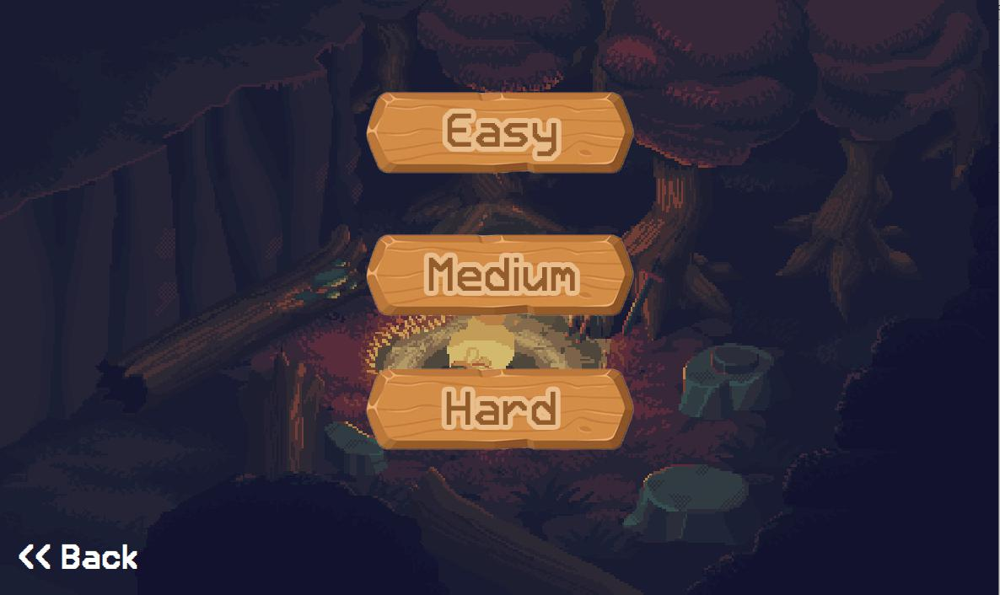
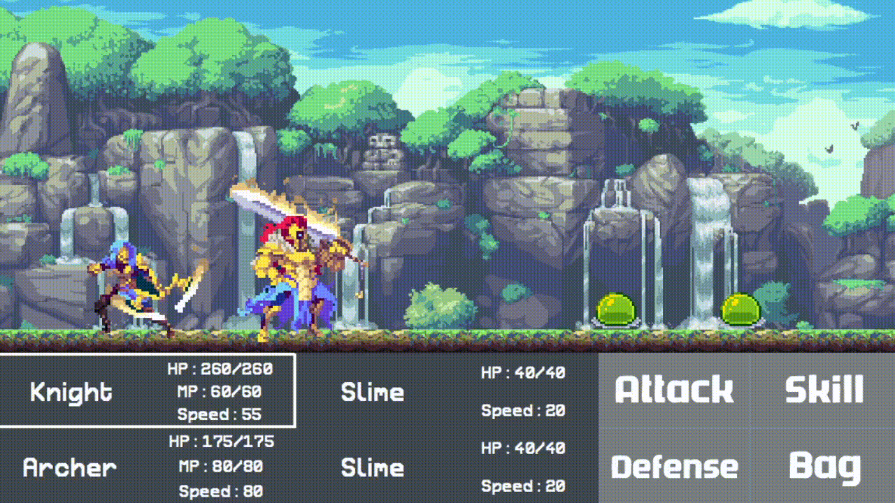
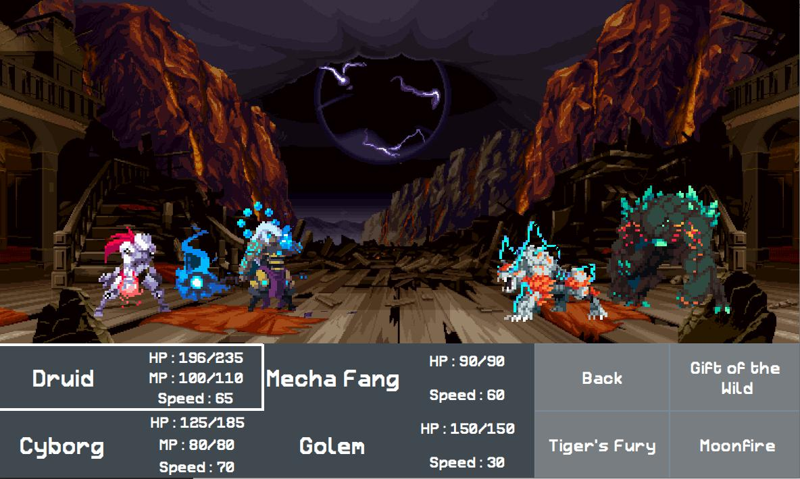
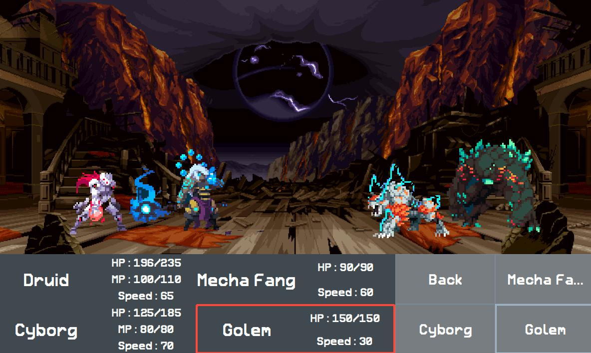
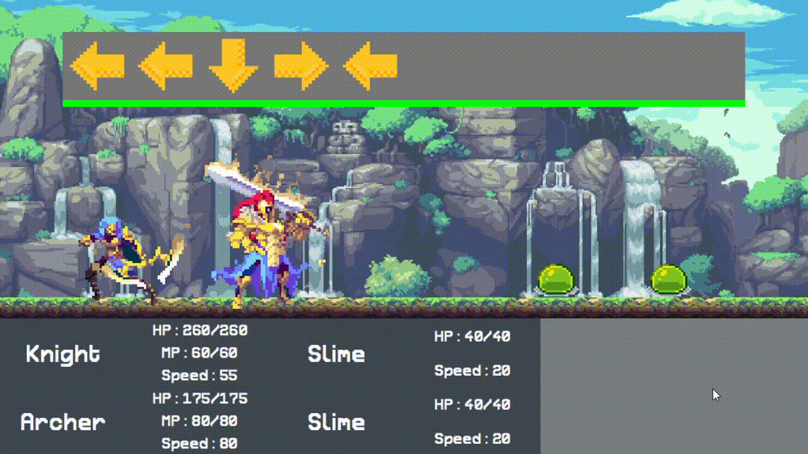
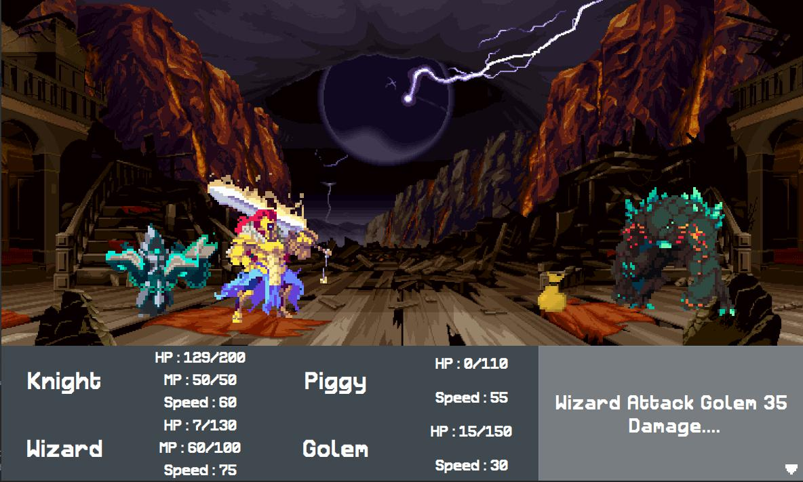
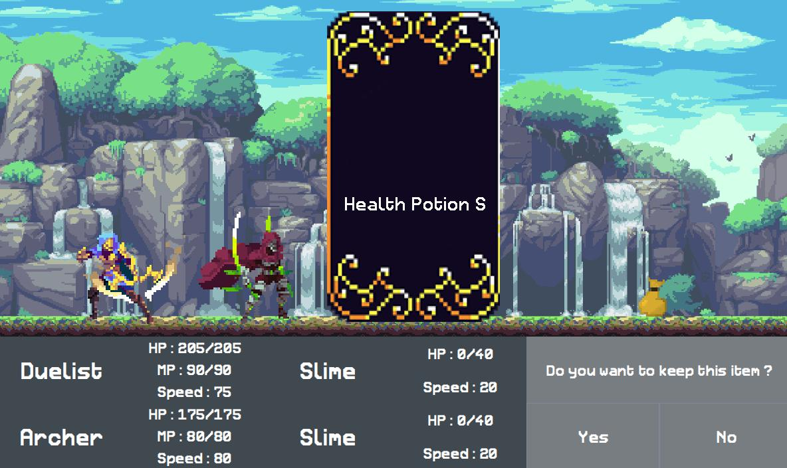
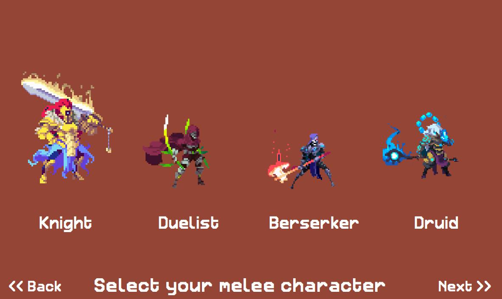
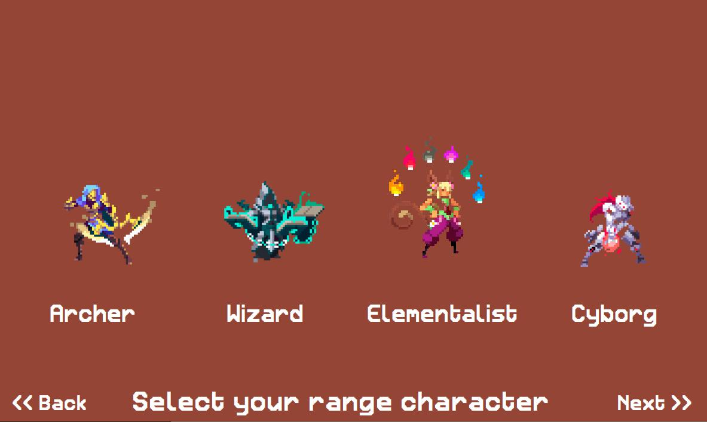

# OOP_Project
Game Project for OOP subject in IT KMITL

# Audition Quest 2 : Game

## Abstract :memo:
คณะผู้จัดทำมีวัตถุประสงค์เพื่อให้ผู้ที่สนใจ ได้ศึกษาค้นคว้าข้อมูลเกี่ยวกับเกม โดยเนื้อหาของเกมจะมีลักษณะคล้ายเกมออดิชั่นผสมกับเกม RPG Turn-Base ที่เราสามารถเลือกตัวละครได้ โดยในแต่ละเทิร์น จะสามารถเลือกได้ว่า จะทำอะไรระหว่าง โจมตีปกติ / ใช้สกิล / ใช้ของในประเป๋า / ป้องกัน โดยถ้ากดโจมตีหรือใช้สกิล จะมีการสุ่มบนล่างซ้ายขวา โดยให้กดภายในเวลาที่กำหนด หากกดทันก็จะทำดาเมจใส่ศัตรู หากกดไม่ทันจะโดนดาเมจใส่ตัวเอง ความยากจะขึ้นอยู่กับประเภทการโจมตีที่ใช้ และในการเล่นแต่ละครั้งจะมีด่าน พร้อมกับระดับความยาก-ง่ายให้เลือกเล่น ส่วนแต่ละความยาก จะมีศัตรูที่แตกต่างกัน, ความยาวด่านที่แตกต่างกัน โดยในแต่ละครั้งที่เล่นก็มีโอกาสที่จะได้พบกับศัตรูต่างๆไม่เหมือนกันในทุกๆครั้ง  

## Benefits :game_die:
ฝึกสมาธิ ความอดทนและการตอบสนองของร่างกาย โดยใช้เกมในการทำให้อยากเล่น

## Built With :wrench:
- Java Language.
- Library awt, swing.

## Download :open_file_folder:
- Download zip file from [here](https://github.com/Fyefee/OOP_Project/archive/refs/heads/Jeff.zip)
- Extract the file.
- Compile "Main.java" in directory "Main" to start.

## In Game :video_game:
 
 
 
 

## Select Character :muscle:
 

## Difficulty :space_invader:

## How to play :bulb:
- เลือกระดับความยาก โดยในแต่ละความยากจะมีศัตรูและความยาวด่านแตกต่างกันไป
- เริ่มมาเราจะต้องเลือกตัวละคร โดยต้องเลือกตัวละครระยะใกล้และไกล อย่างละตัว
- เมื่อเข้าไปในด่าน เราต้องเลือกว่าจะทำอะไรระหว่าง โจมตีปกติ / ใช้สกิล / ใช้ของในประเป๋า / ป้องกัน
- ถ้าเราเลือกโจมตี หรือใช้สกิล เราจะมีการสุ่มบนล่างซ้ายขวา โดยให้กดภายในเวลาที่กำหนด เมื่อกดเสร็จจะทำการโจมตีใส่ศัตรูที่เลือกไว้ โดนดาเมจจะขึ้นอยู่กับจำนวนที่กดทัน
- ถ้าศัตรูตาย จะมีของดรอปมาจากศัตรูโดยเราจะสามารถเลือกได้ว่าจะเก็บหรือไม่เก็บ
- ถ้าเราเลือกกระเป๋า เราจะสามารถเลือกของที่อยู่ในกระเป๋ามาใข้งานได้
- ถ้าเราเลือกป้องกัน เราจะได้รับดาเมจที่ได้รับลดลงครึ่งนึง
- เมื่อถึงจุดๆนึงในแต่ละระดับความยาก จะมีศัตรูประเภท Boss มาให้ต่อสู้ โดยศัตรูประเภทนี้จะแข็งแกร่งกว่าศัตรูแบบปกติ
- เราจะต้องเล่นไปเรื่อยๆ โดยจะต้องบริหารของที่ใช้เพื่อที่จะสามารถอยู่รอดได้จนจบเกม  

## Author :computer:
||||||
|:---:|:---:|:---:|:---:|:---:|
|[jeffy34931](https://github.com/Fyefee)|[jinnygym](https://github.com/jinnygym)|-|-|-|
|นายชวิน โล่ห์รัตนเสน่ห์ - 62070045 -|นางสาวศุภิสรา ชีวนันทพร - 61070230 -|นายธีรภัทร์ บุญช่วยแล้ว - 62070096 -|นายภคิน เลิศพรสุขสวัสดิ์ - 62070143 -|นายอัครพงศ์ พัฒนภักดี - 62070221 -|

## Special Thanks :pray:
- https://www.pinterest.com/bibblespork/
